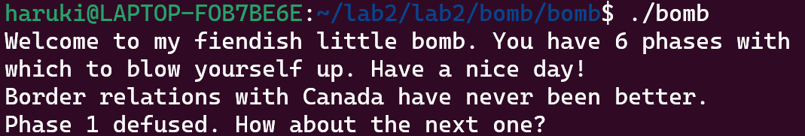
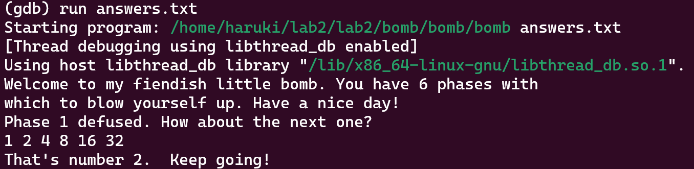
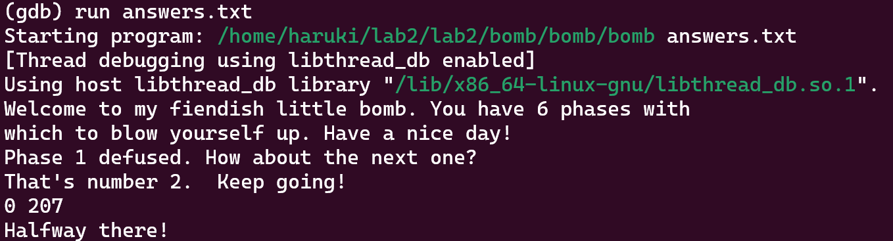
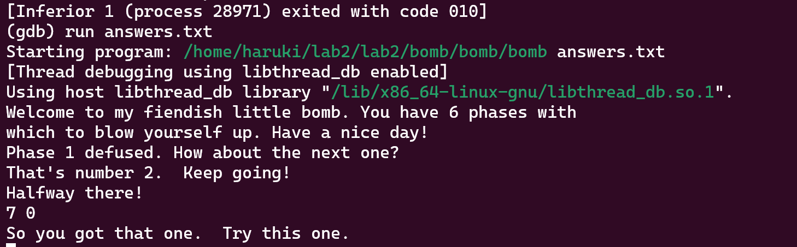
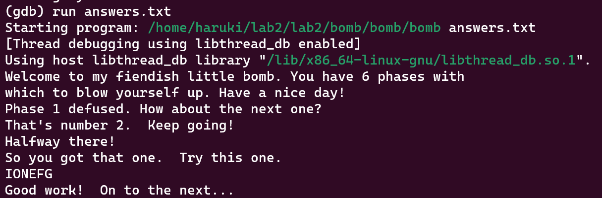
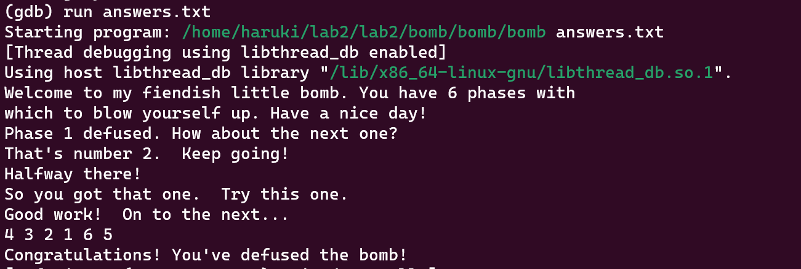
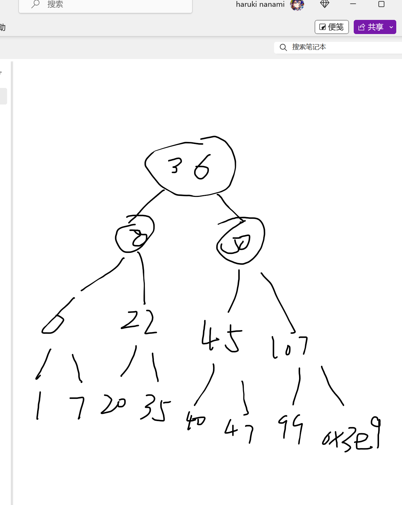
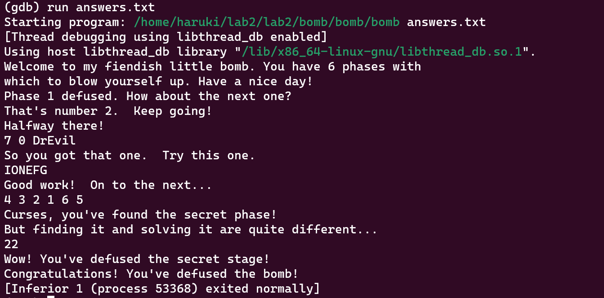

#   Bomblab
## 曾浩然 10235101562
# 前置 gdb的安装
输入代码即可安装
```
apt install gdb
```
# phase1
```cpp
initialize_bomb();

    printf("Welcome to my fiendish little bomb. You have 6 phases with\n");
    printf("which to blow yourself up. Have a nice day!\n");

    /* Hmm...  Six phases must be more secure than one phase! */
    input = read_line();             /* Get input                   */
    phase_1(input);                  /* Run the phase               */
    phase_defused();                 /* Drat!  They figured it out!
				      * Let me know how they did it. */
```
看代码可知首先用initialize_bomb重载了炸弹，然后一个介绍语，read_line读取输入，进行判断

然后我们分析汇编代码来得到结果

采用gdb的disas指令来得到

```
gdb bomb
(gdb) disas phase_1
```
得到
```
Dump of assembler code for function phase_1:
   0x0000000000400ee0 <+0>:     sub    $0x8,%rsp
   0x0000000000400ee4 <+4>:     mov    $0x402400,%esi
   0x0000000000400ee9 <+9>:     call   0x401338 <strings_not_equal>
   0x0000000000400eee <+14>:    test   %eax,%eax
   0x0000000000400ef0 <+16>:    je     0x400ef7 <phase_1+23>
   0x0000000000400ef2 <+18>:    call   0x40143a <explode_bomb>
   0x0000000000400ef7 <+23>:    add    $0x8,%rsp
   0x0000000000400efb <+27>:    ret
End of assembler dump.
```
可得知逻辑大概就是

分配栈帧

把立即数0x402400 放到寄存器esi中

调用 strings_not_equal 函数然后判断返回值是否为0，如果是0就跳到400ef7然后恢复栈帧结束否则就调用explode_bomb引爆炸弹

所以核心就在于strings_not_equal函数

```
(gdb) disas strings_not_equal
Dump of assembler code for function strings_not_equal:
   0x0000000000401338 <+0>:     push   %r12
   0x000000000040133a <+2>:     push   %rbp
   0x000000000040133b <+3>:     push   %rbx
   0x000000000040133c <+4>:     mov    %rdi,%rbx
   0x000000000040133f <+7>:     mov    %rsi,%rbp
   0x0000000000401342 <+10>:    call   0x40131b <string_length>
   0x0000000000401347 <+15>:    mov    %eax,%r12d
   0x000000000040134a <+18>:    mov    %rbp,%rdi
   0x000000000040134d <+21>:    call   0x40131b <string_length>
   0x0000000000401352 <+26>:    mov    $0x1,%edx
   0x0000000000401357 <+31>:    cmp    %eax,%r12d
   0x000000000040135a <+34>:    jne    0x40139b <strings_not_equal+99>
   0x000000000040135c <+36>:    movzbl (%rbx),%eax
   0x000000000040135f <+39>:    test   %al,%al
   0x0000000000401361 <+41>:    je     0x401388 <strings_not_equal+80>
   0x0000000000401363 <+43>:    cmp    0x0(%rbp),%al
   0x0000000000401366 <+46>:    je     0x401372 <strings_not_equal+58>
   0x0000000000401368 <+48>:    jmp    0x40138f <strings_not_equal+87>
   0x000000000040136a <+50>:    cmp    0x0(%rbp),%al
   0x000000000040136d <+53>:    nopl   (%rax)
   0x0000000000401370 <+56>:    jne    0x401396 <strings_not_equal+94>
   0x0000000000401372 <+58>:    add    $0x1,%rbx
   0x0000000000401376 <+62>:    add    $0x1,%rbp
   0x000000000040137a <+66>:    movzbl (%rbx),%eax
--Type <RET> for more, q to quit, c to continue without paging--
   0x000000000040137d <+69>:    test   %al,%al
   0x000000000040137f <+71>:    jne    0x40136a <strings_not_equal+50>
   0x0000000000401381 <+73>:    mov    $0x0,%edx
   0x0000000000401386 <+78>:    jmp    0x40139b <strings_not_equal+99>
   0x0000000000401388 <+80>:    mov    $0x0,%edx
   0x000000000040138d <+85>:    jmp    0x40139b <strings_not_equal+99>
   0x000000000040138f <+87>:    mov    $0x1,%edx
   0x0000000000401394 <+92>:    jmp    0x40139b <strings_not_equal+99>
   0x0000000000401396 <+94>:    mov    $0x1,%edx
   0x000000000040139b <+99>:    mov    %edx,%eax
   0x000000000040139d <+101>:   pop    %rbx
   0x000000000040139e <+102>:   pop    %rbp
   0x000000000040139f <+103>:   pop    %r12
   0x00000000004013a1 <+105>:   ret
End of assembler dump.
```
重点部分
```
0x000000000040133f <+7>:     mov    %rsi,%rbp
0x0000000000401342 <+10>:    call   0x40131b <string_length>
0x0000000000401347 <+15>:    mov    %eax,%r12d
0x000000000040134a <+18>:    mov    %rbp,%rdi
0x000000000040134d <+21>:    call   0x40131b <string_length>
0x0000000000401352 <+26>:    mov    $0x1,%edx
0x0000000000401357 <+31>:    cmp    %eax,%r12d
0x000000000040135a <+34>:    jne    0x40139b <strings_not_equal+99>
0x000000000040135c <+36>:    movzbl (%rbx),%eax
0x000000000040135f <+39>:    test   %al,%al
0x0000000000401361 <+41>:    je     0x401388 <strings_not_equal+80>
0x0000000000401363 <+43>:    cmp    0x0(%rbp),%al
```
我们可以发现他把m[rbx]->eax 然后比较m[rbp] 和al寄存器里面的值,所以查看0x402400位置的值然后直接输入这个结果
```
(gdb) x/s 0x402400
0x402400:       "Border relations with Canada have never been better."
```
运行检验一下

成功
# phase2
进行disas指令,这里贴出重点部分
```
0x0000000000400efe <+2>:     sub    $0x28,%rsp
0x0000000000400f02 <+6>:     mov    %rsp,%rsi
0x0000000000400f05 <+9>:     call   0x40145c <read_six_numbers>
0x0000000000400f0a <+14>:    cmpl   $0x1,(%rsp)
```
分配大小为40字节的栈帧然后把栈帧指针传递给%rsi寄存器接下来调用read_six_numbers

那就阅读read_six_numbers
```
0x000000000040145c <+0>:     sub    $0x18,%rsp
0x0000000000401460 <+4>:     mov    %rsi,%rdx
0x0000000000401463 <+7>:     lea    0x4(%rsi),%rcx
0x0000000000401467 <+11>:    lea    0x14(%rsi),%rax
0x000000000040146b <+15>:    mov    %rax,0x8(%rsp)
0x0000000000401470 <+20>:    lea    0x10(%rsi),%rax
0x0000000000401474 <+24>:    mov    %rax,(%rsp)
0x0000000000401478 <+28>:    lea    0xc(%rsi),%r9
0x000000000040147c <+32>:    lea    0x8(%rsi),%r8
0x0000000000401480 <+36>:    mov    $0x4025c3,%esi
0x0000000000401485 <+41>:    mov    $0x0,%eax
0x000000000040148a <+46>:    call   0x400bf0 <__isoc99_sscanf@plt>
0x000000000040148f <+51>:    cmp    $0x5,%eax
0x0000000000401492 <+54>:    jg     0x401499 <read_six_numbers+61>
0x0000000000401494 <+56>:    call   0x40143a <explode_bomb>
0x0000000000401499 <+61>:    add    $0x18,%rsp
0x000000000040149d <+65>:    ret
```
简单分析一下这个汇编代码这个需要我们输入6个数字然后进行比较
%rsi 存储在phase_2里面传入的%rsp的值也就是栈帧的起始地址

%rdx，由%rsi给出，%rsi又由phrase_2的%rsp给出，所以phrase2中的%rsp地址处存放sscanf中第一个输入的值

%rcx也就是在phase_2%rsp+0x4中存放着第二个值

%r8也就是在phase_2%rsp+0x8中存放着第三个值

%r9也就是在phase_2%rsp+0xc中存放着第四个值

在该函数的%rsp 中存放着第五个值也就是我们把0x10(%rsi),%rax放进了rsp

搞懂后回到phase2来得出答案

先找(rsp) 这里有一个和1的比较可以发现这里必须等于1不然直接引爆炸弹了，所以第一个值就是1

再找(%rsp+0x4)发现rsp+0x4赋给了rbp 那上述代码的前两行就是把rsp里的值翻倍然后放到rsp+0x4 也就是第二个参数是2

同理得到后面4个

答案是1 2 4 8 16 32

检验



成功(这里为了方便将前面的答案存在了answers.txt文件中)
# phase3

阅读汇编代码

```
Dump of assembler code for function phase_3:
   0x0000000000400f43 <+0>:     sub    $0x18,%rsp
   0x0000000000400f47 <+4>:     lea    0xc(%rsp),%rcx
   0x0000000000400f4c <+9>:     lea    0x8(%rsp),%rdx
   0x0000000000400f51 <+14>:    mov    $0x4025cf,%esi
   0x0000000000400f56 <+19>:    mov    $0x0,%eax
   0x0000000000400f5b <+24>:    call   0x400bf0 <__isoc99_sscanf@plt>
   0x0000000000400f60 <+29>:    cmp    $0x1,%eax
   0x0000000000400f63 <+32>:    jg     0x400f6a <phase_3+39>
   0x0000000000400f65 <+34>:    call   0x40143a <explode_bomb>
   0x0000000000400f6a <+39>:    cmpl   $0x7,0x8(%rsp)
   0x0000000000400f6f <+44>:    ja     0x400fad <phase_3+106>
   0x0000000000400f71 <+46>:    mov    0x8(%rsp),%eax
   0x0000000000400f75 <+50>:    jmp    *0x402470(,%rax,8)
   0x0000000000400f7c <+57>:    mov    $0xcf,%eax
   0x0000000000400f81 <+62>:    jmp    0x400fbe <phase_3+123>
   0x0000000000400f83 <+64>:    mov    $0x2c3,%eax
   0x0000000000400f88 <+69>:    jmp    0x400fbe <phase_3+123>
   0x0000000000400f8a <+71>:    mov    $0x100,%eax
   0x0000000000400f8f <+76>:    jmp    0x400fbe <phase_3+123>
   0x0000000000400f91 <+78>:    mov    $0x185,%eax
   0x0000000000400f96 <+83>:    jmp    0x400fbe <phase_3+123>
   0x0000000000400f98 <+85>:    mov    $0xce,%eax
   0x0000000000400f9d <+90>:    jmp    0x400fbe <phase_3+123>
   0x0000000000400f9f <+92>:    mov    $0x2aa,%eax
   0x0000000000400fa4 <+97>:    jmp    0x400fbe <phase_3+123>
   0x0000000000400fa6 <+99>:    mov    $0x147,%eax
   0x0000000000400fab <+104>:   jmp    0x400fbe <phase_3+123>
   0x0000000000400fad <+106>:   call   0x40143a <explode_bomb>
   0x0000000000400fb2 <+111>:   mov    $0x0,%eax
   0x0000000000400fb7 <+116>:   jmp    0x400fbe <phase_3+123>
   0x0000000000400fb9 <+118>:   mov    $0x137,%eax
   0x0000000000400fbe <+123>:   cmp    0xc(%rsp),%eax
   0x0000000000400fc2 <+127>:   je     0x400fc9 <phase_3+134>
   0x0000000000400fc4 <+129>:   call   0x40143a <explode_bomb>
   0x0000000000400fc9 <+134>:   add    $0x18,%rsp
   0x0000000000400fcd <+138>:   ret
```
先分配栈帧

利用%rdx 

也就是0x8+%rsp和利用%rcx 

也就是0xc+%rsp传递sscanf函数用的第三和第四个参数

第二个参数为一个常数0x4025cf随后调用<__isoc99_sscanf@plt>
%rdx里的值必须小于等于7
 
否则直接爆炸

然后我们把第一个输入的值传给%eax

我们要跳转到m[0x402470+r[%rax]*8]

这里我们以传入的第一个参数也就是%rdx的值为0

要跳转的地址就是m[0x402470]

看一下里面的值

```
(gdb) x/x 0x402470
0x402470:       0x00400f7c
```
看看对应代码
```
0x0000000000400f7c <+57>:    mov    $0xcf,%eax
```
这里我们先把0xcf传递给%eax 然后比较0xc(%rsp)也就是我们输入的第二个参数如果和eax相等则完成这表示0 和 0xcf=207(用p 0xcf查看) 就是一个合法答案(当然%rdx取其他值(要小于等于7)也行，方法类似)

这里发现的答案有(0 207 1 311 2 707 3 256 4 389 5 206 6 682 7 327)

检验均通过，这里只放一例



成功

# phase4

首先还是先看操作
```
(gdb) disas phase_4
Dump of assembler code for function phase_4:
   0x000000000040100c <+0>:     sub    $0x18,%rsp
   0x0000000000401010 <+4>:     lea    0xc(%rsp),%rcx
   0x0000000000401015 <+9>:     lea    0x8(%rsp),%rdx
   0x000000000040101a <+14>:    mov    $0x4025cf,%esi
   0x000000000040101f <+19>:    mov    $0x0,%eax
   0x0000000000401024 <+24>:    call   0x400bf0 <__isoc99_sscanf@plt>
   0x0000000000401029 <+29>:    cmp    $0x2,%eax
   0x000000000040102c <+32>:    jne    0x401035 <phase_4+41>
   0x000000000040102e <+34>:    cmpl   $0xe,0x8(%rsp)
   0x0000000000401033 <+39>:    jbe    0x40103a <phase_4+46>
   0x0000000000401035 <+41>:    call   0x40143a <explode_bomb>
   0x000000000040103a <+46>:    mov    $0xe,%edx
   0x000000000040103f <+51>:    mov    $0x0,%esi
   0x0000000000401044 <+56>:    mov    0x8(%rsp),%edi
   0x0000000000401048 <+60>:    call   0x400fce <func4>
   0x000000000040104d <+65>:    test   %eax,%eax
   0x000000000040104f <+67>:    jne    0x401058 <phase_4+76>
   0x0000000000401051 <+69>:    cmpl   $0x0,0xc(%rsp)
   0x0000000000401056 <+74>:    je     0x40105d <phase_4+81>
   0x0000000000401058 <+76>:    call   0x40143a <explode_bomb>
   0x000000000040105d <+81>:    add    $0x18,%rsp
   0x0000000000401061 <+85>:    ret
End of assembler dump.
```
rdx存储了我们读入的第一个参数rcx存储了我们读入的第二个参数这里同样有对sscanf的判断如果不成功直接爆炸

这里我们需要把m[rsp+8]=r[%rdx] 的值和0xe比较。我们设第一个输入的参数是a则a > 0xe则直接爆炸。否则我们构建对调用func4的参数func4(0x8(%rsp),0,0xe) 这里的第一个参数就是a

查看func4
```
(gdb) disas func4
Dump of assembler code for function func4:
   0x0000000000400fce <+0>:     sub    $0x8,%rsp
   0x0000000000400fd2 <+4>:     mov    %edx,%eax
   0x0000000000400fd4 <+6>:     sub    %esi,%eax
   0x0000000000400fd6 <+8>:     mov    %eax,%ecx
   0x0000000000400fd8 <+10>:    shr    $0x1f,%ecx
   0x0000000000400fdb <+13>:    add    %ecx,%eax
   0x0000000000400fdd <+15>:    sar    %eax
   0x0000000000400fdf <+17>:    lea    (%rax,%rsi,1),%ecx
   0x0000000000400fe2 <+20>:    cmp    %edi,%ecx
   0x0000000000400fe4 <+22>:    jle    0x400ff2 <func4+36>
   0x0000000000400fe6 <+24>:    lea    -0x1(%rcx),%edx
   0x0000000000400fe9 <+27>:    call   0x400fce <func4>
   0x0000000000400fee <+32>:    add    %eax,%eax
   0x0000000000400ff0 <+34>:    jmp    0x401007 <func4+57>
   0x0000000000400ff2 <+36>:    mov    $0x0,%eax
   0x0000000000400ff7 <+41>:    cmp    %edi,%ecx
   0x0000000000400ff9 <+43>:    jge    0x401007 <func4+57>
   0x0000000000400ffb <+45>:    lea    0x1(%rcx),%esi
   0x0000000000400ffe <+48>:    call   0x400fce <func4>
   0x0000000000401003 <+53>:    lea    0x1(%rax,%rax,1),%eax
   0x0000000000401007 <+57>:    add    $0x8,%rsp
   0x000000000040100b <+61>:    ret
End of assembler dump.
```
大概转换成c语言便于理解
```c
void func4(int x,int y,int z)  //y的初始值为0，z的初始值为14,t->%rax,k->%ecx
{
  int t=z-y;
  int k=t>>31;
  t=(t+k)>>1;
  k=t+y;
  if(k>x)
  {
    z=k-1;
    func4(x,y,z);
    t=2t;
    return;
  }
  else
   {
     t=0;
     if(k<x)
     {
        y=k+1;
        func4(x,y,z);
        t=2*t+1;
        return;
     }
     else
     {
         return;
     }
   }
}
```
分析得x = k的时候，t=0，即 %eax 为 0，发现边界条件为7

所以答案是7 0

检验


成功
# phase5
上汇编！
```
(gdb) disas phase_5
Dump of assembler code for function phase_5:
   0x0000000000401062 <+0>:     push   %rbx
   0x0000000000401063 <+1>:     sub    $0x20,%rsp
   0x0000000000401067 <+5>:     mov    %rdi,%rbx
   0x000000000040106a <+8>:     mov    %fs:0x28,%rax
   0x0000000000401073 <+17>:    mov    %rax,0x18(%rsp)
   0x0000000000401078 <+22>:    xor    %eax,%eax
   0x000000000040107a <+24>:    call   0x40131b <string_length>
   0x000000000040107f <+29>:    cmp    $0x6,%eax
   0x0000000000401082 <+32>:    je     0x4010d2 <phase_5+112>
   0x0000000000401084 <+34>:    call   0x40143a <explode_bomb>
   0x0000000000401089 <+39>:    jmp    0x4010d2 <phase_5+112>
   0x000000000040108b <+41>:    movzbl (%rbx,%rax,1),%ecx
   0x000000000040108f <+45>:    mov    %cl,(%rsp)
   0x0000000000401092 <+48>:    mov    (%rsp),%rdx
   0x0000000000401096 <+52>:    and    $0xf,%edx
   0x0000000000401099 <+55>:    movzbl 0x4024b0(%rdx),%edx
   0x00000000004010a0 <+62>:    mov    %dl,0x10(%rsp,%rax,1)
   0x00000000004010a4 <+66>:    add    $0x1,%rax
   0x00000000004010a8 <+70>:    cmp    $0x6,%rax
   0x00000000004010ac <+74>:    jne    0x40108b <phase_5+41>
   0x00000000004010ae <+76>:    movb   $0x0,0x16(%rsp)
   0x00000000004010b3 <+81>:    mov    $0x40245e,%esi
   0x00000000004010b8 <+86>:    lea    0x10(%rsp),%rdi
   0x00000000004010bd <+91>:    call   0x401338 <strings_not_equal>
   0x00000000004010c2 <+96>:    test   %eax,%eax
   0x00000000004010c4 <+98>:    je     0x4010d9 <phase_5+119>
   0x00000000004010c6 <+100>:   call   0x40143a <explode_bomb>
   0x00000000004010cb <+105>:   nopl   0x0(%rax,%rax,1)
   0x00000000004010d0 <+110>:   jmp    0x4010d9 <phase_5+119>
   0x00000000004010d2 <+112>:   mov    $0x0,%eax
   0x00000000004010d7 <+117>:   jmp    0x40108b <phase_5+41>
   0x00000000004010d9 <+119>:   mov    0x18(%rsp),%rax
   0x00000000004010de <+124>:   xor    %fs:0x28,%rax
   0x00000000004010e7 <+133>:   je     0x4010ee <phase_5+140>
   0x00000000004010e9 <+135>:   call   0x400b30 <__stack_chk_fail@plt>
   0x00000000004010ee <+140>:   add    $0x20,%rsp
   0x00000000004010f2 <+144>:   pop    %rbx
   0x00000000004010f3 <+145>:   ret
End of assembler dump.
```
%rsp+0x18这个位置存储了我们金丝雀的值这是为了防止缓冲区溢出随后调用string_length 函数来判断输入的字符串长度。可以发现这里规定来我们输入的字符串长度必须是6否则直接爆炸。满足要求后跳转到<phase_5+0x70>
阅读<phase_5+0x70>
```
0x00000000004010d2 <+112>:   mov    $0x0,%eax
0x00000000004010d7 <+117>:   jmp    0x40108b <phase_5+41>
```
把rax=0然后跳转到40108b %rbx=%rdi

再读phase_5,我们可以发现是我们把rsp+0x10位置处的值和0x40245e位置处的值进行比较如果不想等则直接爆炸。因此rsp+0x10位置存储的值必须和0x40245e位置处的值一样
```
(gdb) x/s 0x40245e
0x40245e:       "flyers"
```
可以发现rsp+0x10位置处也必须为"flyers".
那我们传入的就是索引值然后利用索引值来拿到我们需要的“flyers”

f-9 l-15 y-14 e-5 r-6 s-7

加上64

73=I 79=O 78=N 69=E 70=F 77=G

那答案应该是IONEFG

检验



# phase6

还是先读汇编

...好像有点长了拆分着读

```
0x00000000004010f4 <+0>:     push   %r14
0x00000000004010f6 <+2>:     push   %r13
0x00000000004010f8 <+4>:     push   %r12
0x00000000004010fa <+6>:     push   %rbp
0x00000000004010fb <+7>:     push   %rbx
0x00000000004010fc <+8>:     sub    $0x50,%rsp
0x0000000000401100 <+12>:    mov    %rsp,%r13
0x0000000000401103 <+15>:    mov    %rsp,%rsi
0x0000000000401106 <+18>:    call   0x40145c <read_six_numbers>
```
这是得到6个参数的分布类似phase2
```
0x000000000040110b <+23>:    mov    %rsp,%r14
0x000000000040110e <+26>:    mov    $0x0,%r12d
0x0000000000401114 <+32>:    mov    %r13,%rbp
0x0000000000401117 <+35>:    mov    0x0(%r13),%eax
0x000000000040111b <+39>:    sub    $0x1,%eax
0x000000000040111e <+42>:    cmp    $0x5,%eax
0x0000000000401121 <+45>:    jbe    0x401128 <phase_6+52>
0x0000000000401123 <+47>:    call   0x40143a <explode_bomb>
0x0000000000401128 <+52>:    add    $0x1,%r12d
0x000000000040112c <+56>:    cmp    $0x6,%r12d
0x0000000000401130 <+60>:    je     0x401153 <phase_6+95>
0x0000000000401132 <+62>:    mov    %r12d,%ebx
0x0000000000401135 <+65>:    movslq %ebx,%rax
0x0000000000401138 <+68>:    mov    (%rsp,%rax,4),%eax
0x000000000040113b <+71>:    cmp    %eax,0x0(%rbp)
0x000000000040113e <+74>:    jne    0x401145 <phase_6+81>
0x0000000000401140 <+76>:    call   0x40143a <explode_bomb>
0x0000000000401145 <+81>:    add    $0x1,%ebx
0x0000000000401148 <+84>:    cmp    $0x5,%ebx
0x000000000040114b <+87>:    jle    0x401135 <phase_6+65>
0x000000000040114d <+89>:    add    $0x4,%r13
0x0000000000401151 <+93>:    jmp    0x401114 <phase_6+32>
```
大概就是说参数都不能一样。并且每一个都不能大于6然后一直要到r12d=6才能继续
```
0x0000000000401153 <+95>:    lea    0x18(%rsp),%rsi
0x0000000000401158 <+100>:   mov    %r14,%rax
0x000000000040115b <+103>:   mov    $0x7,%ecx
0x0000000000401160 <+108>:   mov    %ecx,%edx
0x0000000000401162 <+110>:   sub    (%rax),%edx
0x0000000000401164 <+112>:   mov    %edx,(%rax)
0x0000000000401166 <+114>:   add    $0x4,%rax
0x000000000040116a <+118>:   cmp    %rsi,%rax
0x000000000040116d <+121>:   jne    0x401160 <phase_6+108>
```
这是一段递归转化成c大致如下
```c
int rsi=6;
func(int i=0){
  a[i]=7-a[i];
  if(i!=6)func(i++);
}
```
继续
```
0x000000000040116f <+123>:   mov    $0x0,%esi
0x0000000000401174 <+128>:   jmp    0x401197 <phase_6+163>
0x0000000000401176 <+130>:   mov    0x8(%rdx),%rdx
0x000000000040117a <+134>:   add    $0x1,%eax
0x000000000040117d <+137>:   cmp    %ecx,%eax
0x000000000040117f <+139>:   jne    0x401176 <phase_6+130>
0x0000000000401181 <+141>:   jmp    0x401188 <phase_6+148>
0x0000000000401183 <+143>:   mov    $0x6032d0,%edx
0x0000000000401188 <+148>:   mov    %rdx,0x20(%rsp,%rsi,2)
0x000000000040118d <+153>:   add    $0x4,%rsi
0x0000000000401191 <+157>:   cmp    $0x18,%rsi
0x0000000000401195 <+161>:   je     0x4011ab <phase_6+183>
0x0000000000401197 <+163>:   mov    (%rsp,%rsi,1),%ecx
0x000000000040119a <+166>:   cmp    $0x1,%ecx
0x000000000040119d <+169>:   jle    0x401183 <phase_6+143>
0x000000000040119f <+171>:   mov    $0x1,%eax
0x00000000004011a4 <+176>:   mov    $0x6032d0,%edx
0x00000000004011a9 <+181>:   jmp    0x401176 <phase_6+130>
```
看代码可知%rdx = m[6032d8]

那么看看里面的值
```
(gdb) x 0x6032d8
0x6032d8 <node1+8>:     0x006032e0
```
可以发现这是一个链表,上面的操作就是从开始一直往后移动。移动的步数等于7-a[i],然后紧接是一个循环,重新排列结点
```
0x00000000004011ab <+183>:   mov    0x20(%rsp),%rbx
0x00000000004011b0 <+188>:   lea    0x28(%rsp),%rax
0x00000000004011b5 <+193>:   lea    0x50(%rsp),%rsi
0x00000000004011ba <+198>:   mov    %rbx,%rcx
0x00000000004011bd <+201>:   mov    (%rax),%rdx
0x00000000004011c0 <+204>:   mov    %rdx,0x8(%rcx)
0x00000000004011c4 <+208>:   add    $0x8,%rax
0x00000000004011c8 <+212>:   cmp    %rsi,%rax
0x00000000004011cb <+215>:   je     0x4011d2 <phase_6+222>
0x00000000004011cd <+217>:   mov    %rdx,%rcx
0x00000000004011d0 <+220>:   jmp    0x4011bd <phase_6+201>
```
串联链表
```
0x00000000004011d2 <+222>:   movq   $0x0,0x8(%rdx)
0x00000000004011da <+230>:   mov    $0x5,%ebp
0x00000000004011df <+235>:   mov    0x8(%rbx),%rax
0x00000000004011e3 <+239>:   mov    (%rax),%eax
0x00000000004011e5 <+241>:   cmp    %eax,(%rbx)
0x00000000004011e7 <+243>:   jge    0x4011ee <phase_6+250>
0x00000000004011e9 <+245>:   call   0x40143a <explode_bomb>
0x00000000004011ee <+250>:   mov    0x8(%rbx),%rbx
0x00000000004011f2 <+254>:   sub    $0x1,%ebp
0x00000000004011f5 <+257>:   jne    0x4011df <phase_6+235>
```
这里看出重新排列完之后的节点必须按照递减的顺序否则就会直接爆炸。

重新排列后大小是node3>node4>node5>node6>node1>node2

最后总结可以把所有部分转换成一个cpp伪代码
```cpp
cin>>a[6];
if(a[i]=a[i+1]||a[i]>6)
bomb();
node1->node2->node3->node4->node5->node6
node3>node4>node5>node6>node1>node2
list *L=new(List(-1)); 
for(int i=1;i<=6;i++){
  if(a[i]==6)L[i]=node1;
  else{
    int b=7-a[i],p=node1;
    while(b--){
      p=p->next;
    }
    L[i]=p;
  }
}
```
答案就是7 - 3 = 4,7 - 4 = 3,7 - 5 = 2,7 - 6 = 1,7 - 1 = 6,7 - 2 = 5
所以输入4 3 2 1 6 5

检验


成功

实验完成了?经查询发现还有一个彩蛋关

在第四关输入7 0过后再输入DrEvil即可进入(具体发现暂不赘述了)

# secret phase
调用函数是phase_defused
```
(gdb) disas secret_phase
Dump of assembler code for function secret_phase:
   0x0000000000401242 <+0>:     push   %rbx
   0x0000000000401243 <+1>:     call   0x40149e <read_line>
   0x0000000000401248 <+6>:     mov    $0xa,%edx
   0x000000000040124d <+11>:    mov    $0x0,%esi
   0x0000000000401252 <+16>:    mov    %rax,%rdi
   0x0000000000401255 <+19>:    call   0x400bd0 <strtol@plt>
   0x000000000040125a <+24>:    mov    %rax,%rbx
   0x000000000040125d <+27>:    lea    -0x1(%rax),%eax
   0x0000000000401260 <+30>:    cmp    $0x3e8,%eax
   0x0000000000401265 <+35>:    jbe    0x40126c <secret_phase+42>
   0x0000000000401267 <+37>:    call   0x40143a <explode_bomb>
   0x000000000040126c <+42>:    mov    %ebx,%esi
   0x000000000040126e <+44>:    mov    $0x6030f0,%edi
   0x0000000000401273 <+49>:    call   0x401204 <fun7>
   0x0000000000401278 <+54>:    cmp    $0x2,%eax
   0x000000000040127b <+57>:    je     0x401282 <secret_phase+64>
   0x000000000040127d <+59>:    call   0x40143a <explode_bomb>
   0x0000000000401282 <+64>:    mov    $0x402438,%edi
   0x0000000000401287 <+69>:    call   0x400b10 <puts@plt>
   0x000000000040128c <+74>:    call   0x4015c4 <phase_defused>
   0x0000000000401291 <+79>:    pop    %rbx
   0x0000000000401292 <+80>:    ret
End of assembler dump.
```
通过上面我们发现如果fun7能够返回2的话我们就完成了彩蛋关

分析func7
```
0x0000000000401204 <+0>:     sub    $0x8,%rsp
0x0000000000401208 <+4>:     test   %rdi,%rdi
0x000000000040120b <+7>:     je     0x401238 <fun7+52>
0x000000000040120d <+9>:     mov    (%rdi),%edx
0x000000000040120f <+11>:    cmp    %esi,%edx
0x0000000000401211 <+13>:    jle    0x401220 <fun7+28>
0x0000000000401213 <+15>:    mov    0x8(%rdi),%rdi
0x0000000000401217 <+19>:    call   0x401204 <fun7>
0x000000000040121c <+24>:    add    %eax,%eax
0x000000000040121e <+26>:    jmp    0x40123d <fun7+57>
0x0000000000401220 <+28>:    mov    $0x0,%eax
0x0000000000401225 <+33>:    cmp    %esi,%edx
0x0000000000401227 <+35>:    je     0x40123d <fun7+57>
0x0000000000401229 <+37>:    mov    0x10(%rdi),%rdi
0x000000000040122d <+41>:    call   0x401204 <fun7>
0x0000000000401232 <+46>:    lea    0x1(%rax,%rax,1),%eax
0x0000000000401236 <+50>:    jmp    0x40123d <fun7+57>
0x0000000000401238 <+52>:    mov    $0xffffffff,%eax
0x000000000040123d <+57>:    add    $0x8,%rsp
0x0000000000401241 <+61>:    ret
```
上面我们取了m[rdi]=m[0x6030f0]的值然后和esi也就是我们输入的值进行比较

那么看看里面的值
```
(gdb) x/120 0x6030f0
0x6030f0 <n1>:  36      0       6304016 0
0x603100 <n1+16>:       6304048 0       0       0
0x603110 <n21>: 8       0       6304144 0
0x603120 <n21+16>:      6304080 0       0       0
0x603130 <n22>: 50      0       6304112 0
0x603140 <n22+16>:      6304176 0       0       0
0x603150 <n32>: 22      0       6304368 0
0x603160 <n32+16>:      6304304 0       0       0
0x603170 <n33>: 45      0       6304208 0
0x603180 <n33+16>:      6304400 0       0       0
0x603190 <n31>: 6       0       6304240 0
0x6031a0 <n31+16>:      6304336 0       0       0
0x6031b0 <n34>: 107     0       6304272 0
0x6031c0 <n34+16>:      6304432 0       0       0
0x6031d0 <n45>: 40      0       0       0
0x6031e0 <n45+16>:      0       0       0       0
0x6031f0 <n41>: 1       0       0       0
0x603200 <n41+16>:      0       0       0       0
0x603210 <n47>: 99      0       0       0
0x603220 <n47+16>:      0       0       0       0
0x603230 <n44>: 35      0       0       0
0x603240 <n44+16>:      0       0       0       0
0x603250 <n42>: 7       0       0       0
0x603260 <n42+16>:      0       0       0       0
0x603270 <n43>: 20      0       0       0
0x603280 <n43+16>:      0       0       0       0
0x603290 <n46>: 47      0       0       0
0x6032a0 <n46+16>:      0       0       0       0
0x6032b0 <n48>: 1001    0       0       0
0x6032c0 <n48+16>:      0       0       0       0
```
发现这是一个树结构,把他画出来

分析后段代码,并转换成c伪代码
```c
int res=0;
func(Bitree *r ,long input){
 if(!r)return 0xffffffff
 if(r->val<=input){ 
     res=0;
     if(r->val <input){
       func(r->right,input);
       res=res*2+1;
     } 
     else return res;
     
}else{
    func(r->left,input);
    res*=2;
}
  return res;
}
```
可知答案是22

检验


成功
# 结语
至此所有phase完成,本实验主要是学习汇编以及gdb的运用,难度比lab1更难一点(因为上网查询的东西更多),当然收获也是非常大的


