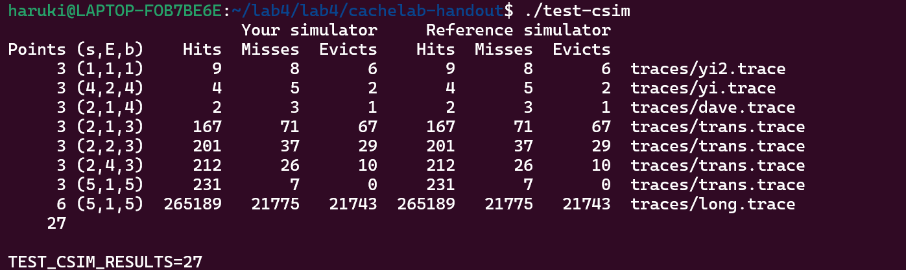
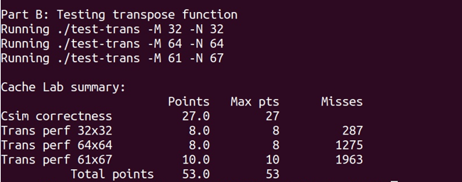

#       Cachelab
## 曾浩然 10235101562
# PART A:Writing a Cache Simulator
## 要求 
Part A 要求在csim.c下编写一个高速缓存模拟器来对内存读写操作进行正确的反馈。要求模拟cache的命中、不命中与牺牲行。需要牺牲行时，用LRU替换策略进行替换
### 关于LRU
LRU是缓存系统中常见的淘汰策略，当内存不足时，我们需要淘汰掉最近最少使用的数据，LRU就是实现这种策略的统称。
## 实验过程(代码加分析)
# 定义Cache结构体
```c
typedef struct CacheLine{
	int used_time;//time of not used  
	char valid;
	unsigned long tag;
}CacheLine, *Cache;
```
CacheLine 为表示一个缓存行的结构体。
used_time 记录该缓存行存的数据从上一次使用到现在的“时间”，即没被使用的操作轮数，用于 LRU。即 used_time 越大，距上一次使用的时间越长，就越先被替换。
valid 记录该缓存行内数据是否有效。
tag 记录该缓存行内数据地址的标记位。
# 读入数据并初始化缓存
```c
int main(int argc, char** argv)
{
	int opt, s, E, b;
	int hit_count = 0, miss_count = 0, eviction_count = 0; 
	FILE *fp = NULL;
	while((opt = getopt(argc, argv, "s:E:b:t:")) != -1)
	{
		if(opt == 's') s = atoi(optarg);
		else if(opt == 'E') E = atoi(optarg);
		else if(opt == 'b') b = atoi(optarg);
		else if(opt == 't') fp = fopen(optarg, "r");
	}
	
	
	int S = 1 << s;//set
	int Line = S * E;
	Cache cache = (Cache)malloc(sizeof(CacheLine) * (Line + 1));//from 1 to Line
	for(int i = 0; i <= Line; i++)
	{
		cache[i].used_time = -1;
		cache[i].valid = '0';
		cache[i].tag = 0;
	}
```
根据命令行参数的读入方法读入数据。其中，读入的 s 表示 64 位的地址中用来表述组数的位数，E 表示每个组中有几行缓存行，b 表示地址中为偏移量的位数。所以可以得到该缓存一共有 S=2^s 组，此处用位运算计算，即 1 左移 s 位。每组一共 E 行，所以该缓存的总行数 Line=S*E。然后构建整个缓存为 cache，再动态分配内存，分配的 CacheLine 的数目为 Line+1，即 cache[0]没有用到，真正用于缓存的下标是从 1 到 Line。所以当组数为 set 时，每一组的下标是从 set*E+1 到 set*E+E。然后将缓存的每一行里的内容初始化。
# 从文件读入指令进行操作
```c
while(fscanf(fp, "%s %lx,%d", oper, &address, &size) != EOF)
	{
		if(oper[0] == 'I')
			continue;
		
		find_tag = (address >> (s + b));
		int set = ((address << (64 - s - b)) >> (64 - s));
		
		int full = 0, find = 0;
		int most = 0, mosti, emptyi;
		
		int times = 1;
		if(oper[0] == 'M') times = 2;
```
读入文件内容，oper 里存指令是进行什么类型的内存读取，当是‘I’的时候，表示是读取指令，可以不用进行操作。Address 为要找的内存地址，其前（64-s-b）位为标记位，此处直接用位运算，将其右移（s+b）位即可计算出相应标记位。中间的 s 位表示组号，先左移（64-s-b）位，再右移
（64-s）位，即可得到相应组号。Full 用于判断缓存中某一组是否存满，find 用于判断是否在缓存的相应组中找到需要的标记位，most 和 mosti 用于 LRU 找到需要替换的那一行，emptyi 用于记录空的缓存行。由于“M”的指令要进行两次的内存读取，所以需要判断出来，对在缓存中查找的操作进行一次循环。
# 从缓存中对应组的每一行进行查找
```c
for(int j = 0; j < times; j++)
		{
			for(int i = set * E + 1; i <= set * E + E; i++)
			{
				if(cache[i].valid == '1')
				{
					if(cache[i].tag == find_tag)
					{
						hit_count++;
						cache[i].used_time = 0;
						find = 1;
					}
					else
					{
						full++;
						cache[i].used_time++;
						if(cache[i].used_time >= most)
						{
							most = cache[i].used_time;
							mosti = i;
						}
					}
				}
				else
				{
					emptyi = i;
				}
			}
        }
```
若该缓存行有效，且标记位等于要查找的标记位，则 hit_count+1，该行距上一次使用到现在的轮数设为 0，将标记是否找到的 find 设为
1。
若该行有效但不是要找的，则 full++，相当于在记录该组内有效的行数，以便在找不到的时候判断该组是否已满，然后该行距上次使用到现在的轮数+1，再判断该行是否是当前最少使用的。若该行无效，表示该行没有存内容，直接该缓存行的下标记录下来。
# 没找到的情况
```c
if(find == 0)
			{
				miss_count++;
				if(full == E)
				{
					eviction_count++;
					cache[mosti].used_time = 0;
					cache[mosti].tag = find_tag;
				}
				else
				{
					cache[emptyi].used_time = 0;
					cache[emptyi].valid = '1';
					cache[emptyi].tag = find_tag;
				}
			}
```
则 miss_count+1，还要进行从内存读取数据到缓存的操作。如果该组内有效行数等于该组总行数，则缓存中的该组已满，会发生冲突，eviction_count+1。然后根据在遍历中判断出的，替换从上一次使用到现在轮数最多的那一行。如果组内有效行数少于总行数，说明该组内还有空的缓存行可以存，就可以直接存到在遍历时记的可用的缓存行中。
# 完整代码
```c
#include "cachelab.h"
#include <getopt.h>
#include <stdio.h>
#include <string.h>
#include <stdlib.h>
#include <unistd.h>

// 定义缓存行结构体
typedef struct CacheLine{
	int used_time;  // 最近使用时间
	char valid;     // 有效位
	unsigned long tag;  // 标记位
}CacheLine, *Cache;

int main(int argc, char** argv)
{
	int opt, s, E, b;
	int hit_count = 0, miss_count = 0, eviction_count = 0; 
	FILE *fp = NULL;
	while((opt = getopt(argc, argv, "s:E:b:t:")) != -1)
	{
		// 读取命令行参数
		if(opt == 's') s = atoi(optarg);  // 组索引位数
		else if(opt == 'E') E = atoi(optarg);  // 每组行数
		else if(opt == 'b') b = atoi(optarg);  // 块偏移位数
		else if(opt == 't') fp = fopen(optarg, "r");  // trace文件路径
	}
	
	int S = 1 << s;  // 组数
	int Line = S * E;  // 缓存行总数
	Cache cache = (Cache)malloc(sizeof(CacheLine) * (Line + 1));  // 缓存数组，从1到Line
	for(int i = 0; i <= Line; i++)
	{
		cache[i].used_time = -1;  // 初始化最近使用时间为-1
		cache[i].valid = '0';  // 初始化有效位为0
		cache[i].tag = 0;  // 初始化标记位为0
	}

	int size;
	unsigned long address, find_tag;
	char oper[3];
	while(fscanf(fp, "%s %lx,%d", oper, &address, &size) != EOF)
	{
		if(oper[0] == 'I') // I表示指令访问，忽略
			continue;
		
		find_tag = (address >> (s + b));  // 计算标记位
		int set = ((address << (64 - s - b)) >> (64 - s));  // 计算组索引
		
		int full = 0, find = 0;
		int most = 0, mosti, emptyi;
		
		int times = 1;
		if(oper[0] == 'M') times = 2; // M表示修改，访问两次
		
		for(int j = 0; j < times; j++)
		{
			for(int i = set * E + 1; i <= set * E + E; i++)
			{
				if(cache[i].valid == '1')
				{
					if(cache[i].tag == find_tag)// 命中
					{
						hit_count++;
						cache[i].used_time = 0; // 更新最近使用时间
						find = 1;
					}
					else
					{
						full++;	// 有效行数加1
						cache[i].used_time++; // 最近使用时间加1
						if(cache[i].used_time >= most)
						{
							most = cache[i].used_time;
							mosti = i;
						}
					}
				}
				else
				{
					emptyi = i; // 记录空闲行
				}
			}
			
			if(find == 0) // 未命中
			{
				miss_count++;
				if(full == E) // 缓存满，需要替换
				{
					eviction_count++;
					cache[mosti].used_time = 0;
					cache[mosti].tag = find_tag;
				}
				else // 缓存未满，填充空闲行
				{
					cache[emptyi].used_time = 0;
					cache[emptyi].valid = '1';
					cache[emptyi].tag = find_tag;
				}
			}
		}	
	}
    fclose(fp);
    printSummary(hit_count, miss_count, eviction_count);  // 打印统计信息
    free(cache);  // 释放内存
    return 0;
}

```
# 检验运行

# Part B:Optimizing Matrix Transpose
## 要求
优化一个矩阵转置函数，使得cache miss尽可能少。cache规模为：32组，直接映射，每行32字节数据。
## 思路
应用矩阵分块的思想,具体见下
# 实验过程
## 32 * 32
块偏移量是 32 个字节，可以存 8 个 int，所以访问的时候要尽量使用存入的这 8 个 int 才能增加命中率。而 32*32 的矩阵一行里有 32 个 int，可以存满 4 行缓存行，所以矩阵里的 8 行数据可以占满整个缓存。即按行遍历整个矩阵的时候，遍历到第 9 行的时候，缓存就会发生冲突不命中，所以
在读到第 9 行前要尽量把前面 8 行存入缓存的数据都利用完。所以在矩阵转置的时候考虑以 8 行为一个单位来转置。
在矩阵转置的时候，矩阵 A 是按行遍历的，矩阵 B 是按列，且矩阵 A、B 会存到同一个缓存里，对应的位置也相同，即读 B 的第一行的时候会把缓存里 A 的第一行覆盖掉。所以考虑在读入的时候把 A 在一个缓存行的 8 个元素存入寄存器内，即临时变量里，然后再从临时变量赋值给 B 里的元素。
所以相当于是以 8 行为单位，每行每次存 8 个元素。就相当于把矩阵分成 8*8 的小的矩阵，A 的每个小矩阵中的一行需要存到临时变量里，然后再由临时变量存到 B 的一列里，也相当于循环展开。
```c
if(N==32)
	{
		int a[8];
		for(int i = 0; i < N; i += 8)
		 for(int j = 0; j < M; j += 8)
		 {
			for(int i1 = 0; i1 < 8; i1++)
			{
				for(int j1 = 0; j1 < 8; j1++)
					a[j1] = A[i + i1][j + j1];

				for(int j1 = 0; j1 < 8; j1++)
					B[j + j1][i + i1] = a[j1];
			}
		}	
	}
```
## 61 * 67 && 64 * 64
前者类似32 * 32只是在循环中要加上对边界的限制。

后者一开始考虑用相同的方法。考虑到矩阵的 4 行可以填满整个缓存，所以打算以 4*4 的小矩阵为单位进行转置。结果发现可以把不命中的次数降到1701。但是因为在一个缓存行中还是可以存 8 个int，用 4*4 的小矩阵会浪费存入缓存的数据，所以还是得考虑以 8*8 为单位，只是在对 8*8 的小矩阵进行转置的时候再分成 4*4 的小矩阵考虑。
先把 8*8 矩阵左上角的 4*4 的小矩阵转置，转置时还得保存每一行的后 4 个数据元素，这样才能充分利用缓存中存的元素。因为临时变量除去下标后只有 8 个，只够用于一行的转置，所以利用 B 中的缓存，A 中一行的后 4 个元素就临时存到B 中对应行的后 4 个位置，这样还可以充分利用 B 的缓存。此时完成对左上角 4*4 矩阵的转置，而右上角 4*4 矩阵的元素存在 B 的右上角。
然后把 B 右上角暂存的数据放入前 4 个临时变量，把要转置到 B 的右上角的 A 的左下角的数据放入后 4 个临时变量，然后就可以用临时变量给 B 的右上角和左下角赋值，就可以完成对 B 右上角和左下角的 4*4 的小矩阵的转置。最后再直接对左下角的 4*4 小矩阵进行转置。
```c
else if(N==67)
	{
		int a[8];
		for(int i = 0; i < N; i += 8)
		 for(int j = 0; j < M; j += 8)
		 {
			for(int i1 = 0; i1 < 8 && i1 + i < N; i1++)
			{
				for(int j1 = 0; j1 < 8 && j1+j < M; j1++)
					a[j1] = A[i + i1][j + j1];

				for(int j1 = 0; j1 < 8 && j1 + j < M; j1++)
					B[j + j1][i + i1] = a[j1];
			}
		}	
	}
	else if(N==64)
	{
		int a[8];
		for(int i = 0; i < N; i += 8)
		 for(int j = 0; j < M; j += 8)
		 {
			for(int i1 = 0; i1 < 4 && i1 + i < N; i1++)
			{
				for(int j1 = 0; j1 < 8 && j1 + j < M; j1++)
					a[j1] = A[i + i1][j + j1];

				for(int j1 = 0; j1 < 4 && j1 + j < M; j1++)
				{
					B[j + j1][i + i1] = a[j1];
					B[j + j1][i + i1 + 4] = a[j1 + 4];
				}
			}
			for(int j1 = 0; j1 < 4; j1++)
			{
				for(int i1 = 4; i1 < 8; i1++)
					a[i1 - 4] = B[j1 + j][i1 + i];

				for(int i1 = 4; i1 < 8; i1++)
					a[i1] = A[i1 + i][j1 + j];

				for(int i1 = 4; i1 < 8; i1++)
					B[j1 + j][i1 + i] = a[i1];

				for(int i1 = 0; i1 < 4; i1++)
					B[j + j1 + 4][i + i1] = a[i1];
			}
			for(int i1 = 4; i1 < 8; i1++)
			{
				for(int j1 = 4; j1 < 8; j1++)
					a[j1 - 4] = A[i1 + i][j1 + j];

				for(int j1 = 4; j1 < 8; j1++)
					B[j1 + j][i1 + i] = a[j1 - 4];
			}
		}
	}
}
```
## 检验


